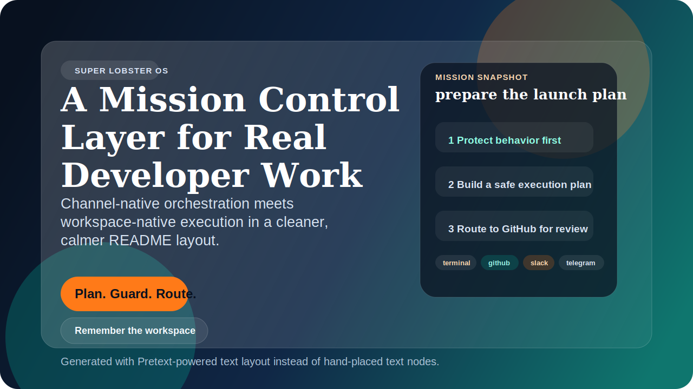
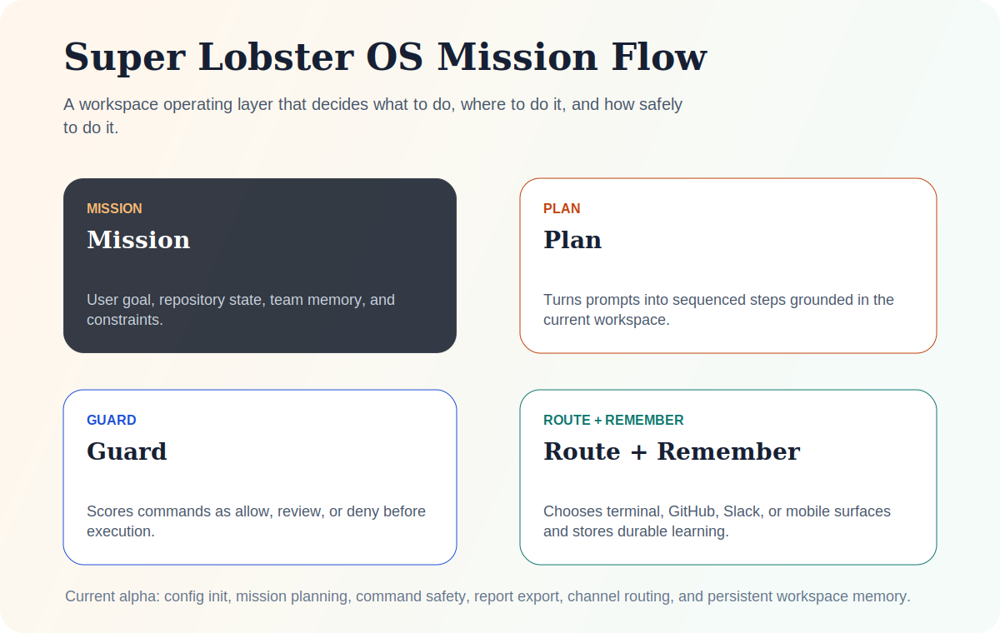

<div align="center">
  
</div>

<h1 align="center">Super Lobster OS</h1>

<p align="center">
  <strong>실제 개발 미션을 위한 터미널 우선 AI 운영체제.</strong>
</p>

<p align="center">
  Super Lobster OS 는 두 가지 강점을 하나의 공개 프로젝트로 재구성한 clean-room 구현입니다.<br>
  <strong>채널 네이티브 오케스트레이션</strong> 과 <strong>워크스페이스 네이티브 실행</strong>.
</p>

<p align="center">
  <a href="./README.md">English</a>
  ·
  <a href="./README.zh-CN.md">简体中文</a>
  ·
  <a href="./README.ja.md">日本語</a>
  ·
  <a href="./README.es.md">Español</a>
  ·
  <strong>한국어</strong>
</p>

<p align="center">
  <a href="https://github.com/wimi321/super-lobster-os/actions/workflows/ci.yml"></a>
  <a href="./LICENSE"></a>
  
  
</p>

## 프로젝트 방향

지금의 AI 개발 도구는 대체로 두 극단 중 하나에 머뭅니다.

- 채팅 채널에는 강하지만 저장소 이해도가 낮다.
- 저장소는 잘 이해하지만 결국 더 똑똑한 터미널 탭처럼 느껴진다.

**Super Lobster OS** 는 이 둘을 함께 가져가려는 프로젝트입니다.

- 워크스페이스를 이해하고
- 팀이 이미 검증한 지식을 기억하고
- 실행 전에 운영 리스크를 판단하고
- 다음 단계를 terminal, GitHub, Slack, 모바일 중 적절한 표면으로 라우팅하며
- 동시에 공개 저장소로 안전하게 성장할 수 있어야 합니다.

## 무엇이 다른가

| 기능 | 실제 가치 |
| --- | --- |
| Mission Planning | 현재 워크스페이스에 맞춘 구조화된 실행 계획 생성 |
| Safety Guardrails | 파괴적 명령을 차단하고 민감한 작업은 검토 대상으로 분류 |
| Persistent Memory | `.lobsteros/memory.json` 에 장기 지식을 저장 |
| Channel Routing | terminal, GitHub, Slack, 모바일 중 적절한 작업 표면 추천 |
| Clean-room Posture | 강한 생태계에서 영감을 얻되 코드는 공개 가능한 독자 구현 |
| Markdown Reports | issue, PR, handoff 에 바로 붙일 수 있는 보고서 출력 |

## 왜 이 프로젝트를 만드는가

Super Lobster OS 는 다음에서 영감을 받은 **clean-room** 프로젝트입니다.

- OpenClaw 의 channel-native operator 철학
- 현대 coding agent 의 workspace-aware 작업 흐름

이 저장소는 Claude Code 의 독점 소스코드를 배포하지 않습니다.
유용한 상호작용 패턴을 공개 가능한 독자 구현으로 다시 세워, 법적 리스크가 큰 사적 포크가 아니라 진짜 공개 프로젝트로 키우는 것이 목표입니다.

## 현재 기능

- `lobsteros init` 으로 `.lobsteros/config.json` 초기화
- `lobsteros plan` 으로 워크스페이스 기반 미션 계획 생성
- `lobsteros report` 로 markdown 미션 보고서 출력
- `lobsteros guard` 로 명령을 `allow`, `review`, `deny` 로 분류
- `lobsteros route` 로 최적의 협업 표면 추천
- `lobsteros learn` 으로 장기 지식 저장
- `lobsteros doctor` 로 프로젝트 상태와 메모리 상태 점검

## 빠른 시작

```bash
git clone https://github.com/wimi321/super-lobster-os.git
cd super-lobster-os
npm test
node src/cli.mjs init --workspace "Payments Core"
node src/cli.mjs plan --message "refactor the billing retry worker"
node src/cli.mjs report --message "prepare the release checklist"
node src/cli.mjs guard --command "git push origin main"
node src/cli.mjs route --target github
node src/cli.mjs learn --note "billing retries depend on redis locks"
node src/cli.mjs doctor
```

## 아키텍처

<div align="center">
  
</div>

### 핵심 모듈

- `src/core/config.mjs`: 워크스페이스 초기화 및 설정 로드
- `src/core/workspace-memory.mjs`: 장기 미션 메모리와 학습 내용 저장
- `src/core/planner.mjs`: 프롬프트와 워크스페이스 구조 기반 계획 생성
- `src/core/safety-policy.mjs`: 명령 안전성 분류 및 위험 명령 차단
- `src/core/channel-router.mjs`: terminal, GitHub, Slack, Telegram 용 표면 추천
- `src/core/reporter.mjs`: markdown 미션 브리프 생성
- `src/core/mission-control.mjs`: 전체 오케스트레이션 계층
- `src/cli.mjs`: 외부 의존성이 거의 없는 CLI 진입점

더 자세한 내용은 [docs/ARCHITECTURE.md](./docs/ARCHITECTURE.md)

## 개발

```bash
npm test
npm run demo
npm run report
```

## 로드맵

- 더 풍부한 설정 프로필과 policy pack
- approval gate 가 있는 shell 실행 어댑터
- GitHub issue / PR 워크플로우
- Slack / Telegram 실제 연동
- 라이브 TUI 미션 대시보드
- 플러그인 SDK 와 어댑터 마켓플레이스

추가 정보: [docs/ROADMAP.md](./docs/ROADMAP.md)
